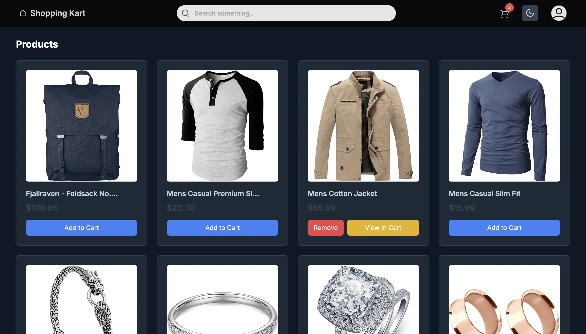
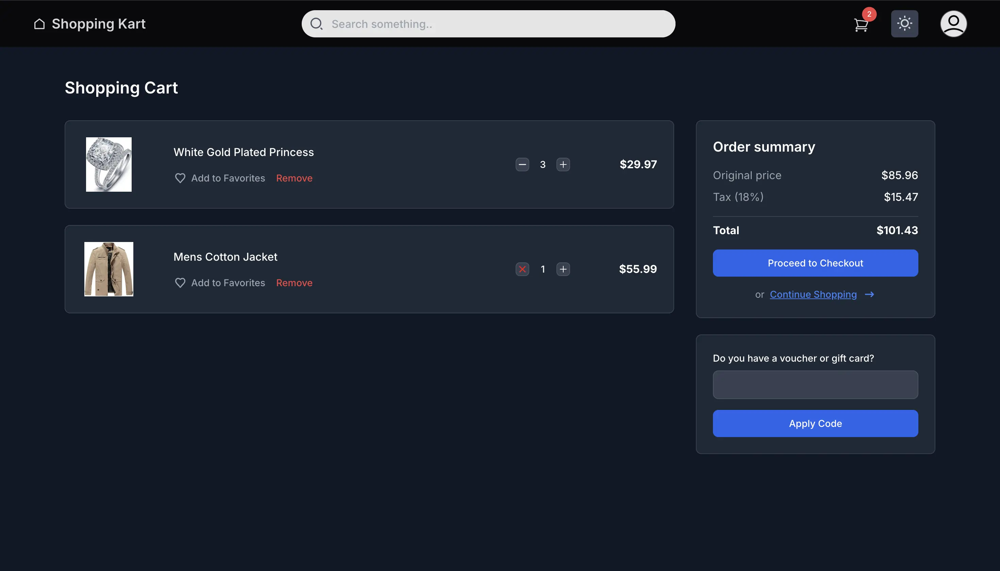

# The Cart App

This is a project made with <b>Next.js </b>, <b>Typescript </b> & <b>Tailwindcss </b>

## Features

- CRUD for cart items.
- Skeletons for the Product card & Cart items.
- Support for dark and light mode using custom hook.
- Cart icon badge show total number of unique elemnts in the cart.
- Currency format function in the utils folder.
- Adding to the cart returns a promise for a similar experience to that of api being called.
- Smaller ui details such as the subtract icon changes to remove icon if the quantity is 1 in cart.

## Getting Started

First, run the development server:

```bash
npm run dev
# or
yarn dev
# or
pnpm dev
# or
bun dev
```

Open [http://localhost:3000](http://localhost:3000) with your browser to see the result.

## Screenshots

#### - Home Page



#### - Cart Page


